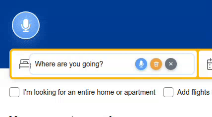
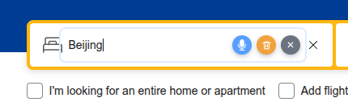
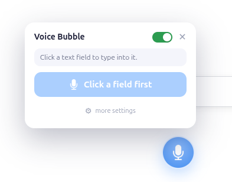
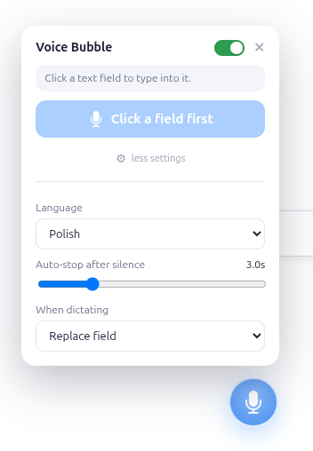

# 🎙️ Voice Bubble

**Hands-free typing — a floating mic bubble that dictates speech into any text
field in Chrome.**

Click a text box on any page, press the mic, and talk — your words are typed into
that field live. Built for hands-free / one-handed use, but handy any time
talking is faster than typing.

<p align="center">
  <br>
  <em><a href="docs/vb_demo.mp4">▶ watch the demo (mp4)</a></em>
</p>

- 🫧 A floating, **draggable** mic bubble on every page.
- 🎯 Types into **whatever field you click** — inputs, textareas, and
  `contenteditable` editors (works with React/controlled inputs).
- 🌍 **18 languages**, switchable on the fly.
- 🤫 **Auto-stop after silence** (configurable).
- ✍️ **Append** to a field or **replace** it on each dictation.
- 🔒 Microphone is granted **once** and reused on every site.

---

## Why I built this

I made Voice Bubble for my girlfriend. She dislocated her pointer finger and
spent weeks with her arm in a plaster cast, which made everyday typing on her
laptop slow and awkward. I wanted to give her a simple way to keep working
comfortably — just click a text field and talk.

If it makes things a little easier for you too, that's exactly what I hoped for. 💙

---

## Requirements

- **Google Chrome** (or Chromium) on the desktop.
- An **internet connection** — speech recognition uses the browser's Web Speech
  API, which sends audio to the browser vendor's servers for transcription.

## Quick start

1. Go to `chrome://extensions`, enable **Developer mode**.
2. **Load unpacked** → select this `voice-bubble/` folder.
3. On first use, allow the **microphone** when prompted (a one-time setup page
   from the extension grants it for every site — see *How it works*).

There is nothing to build or compile: edit a file and reload the extension in
`chrome://extensions`. That's the full dev loop.

## Using it

1. **Click any text field** on a page. It gets a light highlight, and three small
   buttons appear inside its right edge:
   - 🎙️ **record** — start / stop dictation,
   - 🗑️ **clear** — empty the field,
   - **✕** **unselect** — release the field.
2. Press **record** (or the big mic button in the panel) and **talk**. Text is
   inserted as you speak; it auto-stops after a configurable silence.

<p align="center">
  
</p>

### The bubble

The mic bubble is **draggable** — drop it anywhere; its position is remembered.
Click it to open the panel:

- The **header** has a minimal **on/off** switch (pause voice input entirely) and
  a **✕** to close the panel.
- The panel shows the **active field** and a big **mic** button.
- **more settings** reveals the **language**, the **auto-stop silence** timeout,
  and whether dictation **appends** to or **replaces** the field.

The panel opens **below** the bubble when it sits in the top half of the screen,
and **above** it when it sits in the bottom half. The toolbar icon **shows /
hides** the bubble on the current page.

<table>
  <tr>
    <td align="center"><br><sub>Basic view</sub></td>
    <td align="center"><br><sub><b>more settings</b> expanded</sub></td>
  </tr>
</table>

## How it works

Chrome scopes microphone permission **per origin**, so to avoid re-prompting on
every website, the speech recognition runs inside a hidden iframe served from the
**extension's own origin**. Permission is granted once against that origin and
reused everywhere. This splits the code into two parts that talk only over
`postMessage` (guarded by a per-session nonce):

- **`content.js`** — injected into the page. Owns all UI (the bubble, in a shadow
  DOM so page CSS can't touch it), tracks the target field, and inserts text. It
  cannot access the mic.
- **`recognizer.js`** (in the hidden iframe via `recognizer.html`) — owns the
  `SpeechRecognition` object and the silence timer. Has mic access by virtue of
  the extension origin; has no page access.

## Privacy

- Speech is transcribed by the browser's built-in Web Speech API (audio leaves
  your machine to the browser vendor's servers, like any web page using voice
  input). Voice Bubble adds no servers of its own.
- Settings persist locally in `chrome.storage.local` (under `vb_settings`):
  language, silence timeout, insert mode, on/off, and bubble position.

## Project structure

```
voice-bubble/
├── content.js        Floating bubble UI + field tracking + text insertion
├── recognizer.html   Hidden iframe (extension origin) that hosts...
├── recognizer.js     ...the SpeechRecognition session + silence auto-stop
├── permission.html   One-time mic-permission grant page
├── permission.js
├── background.js     Service worker: opens permission page; toolbar show/hide
└── manifest.json
```
